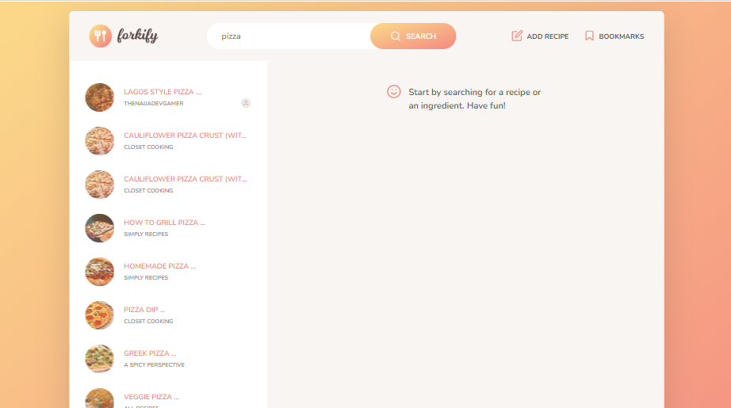
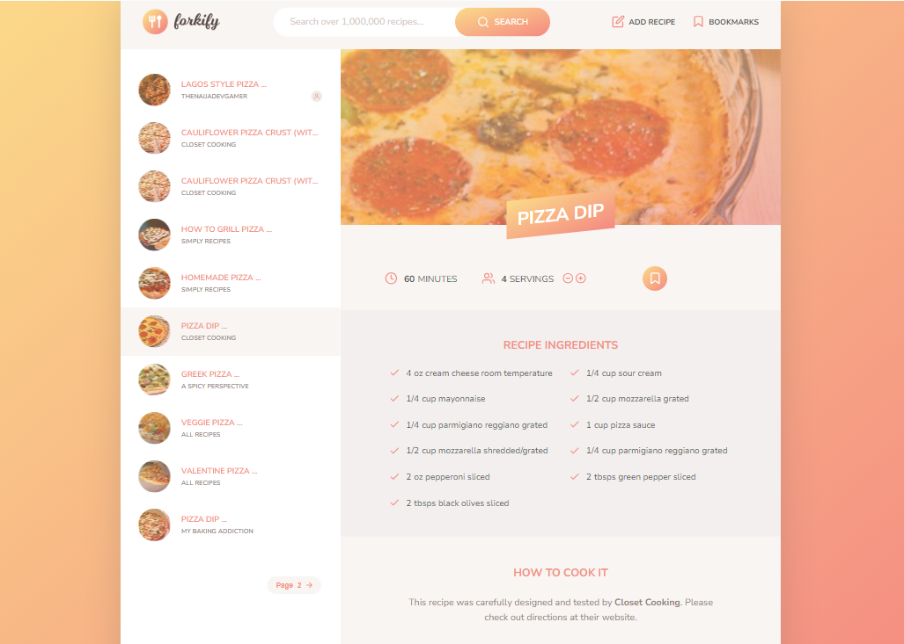

# 🍴 Forkify - Recipe Finder App

  <h3>
    <a href="https://naijadevgamer.github.io/forkify/">
      Demo
    </a>
     | 
    <a href="https://github.com/naijadevgamer/forkify">
      Solution
    </a>
  </h3>

Welcome to **Forkify!** 🎉 This is a fun and interactive recipe finder app where you can search for delicious recipes, bookmark your favorites, and even add your own creations! 😋

## 📖 Table of Contents

- [🌟 Project Overview](#-project-overview)
- [🚀 Features](#-features)
  - [✨ Additional Features by Me](#-additional-features-by-me)
- [🛠️ Tools and Technologies](#%EF%B8%8F-tools-and-technologies)
- [📚 Architecture](#-architecture)
- [🔧 Usage](#-usage)
- [📷 Screenshots](#-screenshots)
- [📝 License](#-license)
- [🔗 Useful Links](#-useful-links)
- [💬 Get in Touch](#-get-in-touch)
- [🙏 Acknowledgements](#-acknowledgements)
- [🎉 Enjoy Cooking!](#-enjoy-cooking)

## 🌟 Project Overview

Forkify is a project inspired by a course created by [Jonas Schmedtmann](https://www.udemy.com/user/jonasschmedtmann/). The app is built using the **MVC architecture** and makes use of various tools and technologies such as **HTML**, **SCSS**, **JavaScript**, **Parcel**, and **Babel**. It's perfect for anyone looking to explore the world of cooking or improve their web development skills! 🍲

## 🚀 Features

Here’s what the Forkify app can do:

- **Recipe Search 🔍**: Search for thousands of recipes by ingredients or dish names.
- **View Recipes 📜**: See detailed instructions and ingredients for each recipe.
- **Responsive Design 📱**: Enjoy a user-friendly experience on both mobile and desktop devices.
- **Bookmark Recipes 💾**: Save your favorite recipes to easily find them later.
- **Add Recipes ➕**: Share your own culinary creations with the world.
- **Delete Recipes ❌**: Remove unwanted recipes that you've added.
- **Pagination 📄**: Browse through search results with ease using pagination.
- **Adjust Servings 🍽️**: Change the number of servings to suit your needs.

### ✨ Additional Features by Me

I've made some improvements to enhance the original project:

- **Responsive Design Enhancements**: The app is now fully responsive across different devices, not just desktops. 🎨
- **User-Friendly Recipe Submission**: Made the form to submit recipes more straightforward and easier to interact with.
- **Delete Recipe Feature**: Added the ability to delete recipes you've created, keeping your list clean and tidy! 🧹

## 🛠️ Tools and Technologies

- **HTML**: Structure and semantics of the web pages.
- **SCSS**: For styling the app with variables and mixins.
- **JavaScript (ES6+)**: Logic and interactivity of the app.
- **Parcel**: Bundler for optimizing and building the app.
- **Babel**: Transpiler to ensure cross-browser compatibility.
- **Core JS** & **Regenerator Runtime**: For polyfilling modern features and ensuring smooth async operations.

## 📚 Architecture

The Forkify app follows the **MVC (Model-View-Controller)** architecture. Here's a brief overview:

- **Model**: Handles the data logic and interactions with external services.
- **View**: Manages the UI components and DOM manipulation.
- **Controller**: Orchestrates the app logic, connecting the model and view.

## 🔧 Usage

- **Search for Recipes**: Use the search bar to find recipes by name or ingredient.
- **View Detailed Recipes**: Click on any recipe to see detailed instructions.
- **Bookmark Your Favorites**: Click the bookmark icon to save recipes you love.
- **Add Your Own Recipes**: Use the "Add Recipe" form to share your culinary masterpieces.
- **Delete Recipes**: Remove any recipes you've added if you change your mind.

## 📷 Screenshots

Here's a sneak peek at the Forkify app:

  
_The Forkify app home page, showcasing delicious recipes._

  
_Detailed recipe view with ingredients and instructions._

## 📝 License

© Copyright by Jonas Schmedtmann. Original project used for learning and portfolio purposes. Additional features added by me.

## 🔗 Useful Links

- [Forkify Live Demo](https://naijadevgamer.github.io/forkify/)
- [Course by Jonas Schmedtmann](https://www.udemy.com/user/jonasschmedtmann/)

## 💬 Get in Touch

Feel free to reach out if you have any questions or suggestions! You can contact me at [sabdullahialaba50@gmail.com](mailto:sabdullahialaba50@gmail.com).

### Connect with me on social media:

- [LinkedIn](https://www.linkedin.com/in/abdullah-saleeman-360170243)
- [GitHub](https://github.com/naijadevgamer)
- [Twitter](https://www.twitter.com/naijadevgamer)
- [Instagram](https://www.instagram.com/naijadevgamer)

## 🙏 Acknowledgements

First and foremost, all praises to Allah for giving me the strength and ability to complete this project.
A big thank you to **Jonas Schmedtmann** for his insightful course and foundational project that inspired Forkify. This project wouldn't be possible without his excellent teaching and guidance.

## 🎉 Enjoy Cooking!

We hope you enjoy using Forkify and find all the recipes you need to make your cooking experience delightful. Happy cooking! 👨‍🍳👩‍🍳
